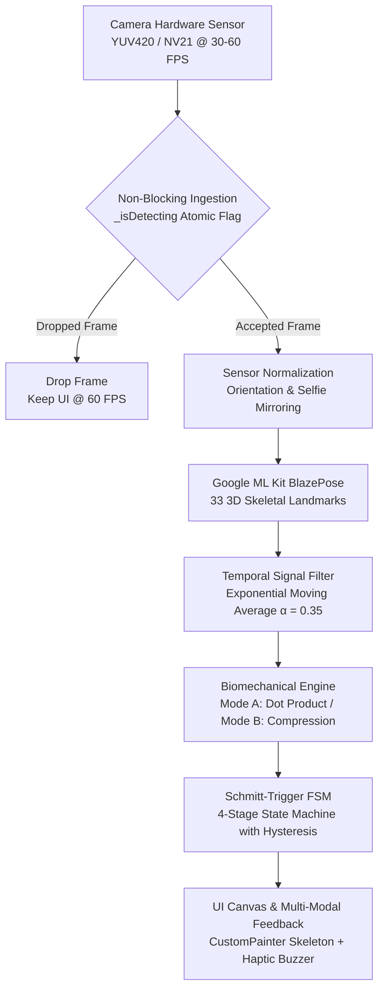

# ⚡ RIVALS — Real-Time On-Device AI Calisthenics Engine

<div align="center">

[](https://flutter.dev)
[](https://dart.dev)
[](https://developers.google.com/ml-kit)
[](https://github.com/cosmicbyt123/RIVLAS)
[](https://github.com/cosmicbyt123/RIVLAS/releases)

**Commercial-grade, zero-calibration calisthenics tracking and fitness games powered by edge computer vision.**

[The Problem](#-the-problem-why-most-fitness-apps-fail) • [The Solution](#-the-solution-what-rivals-does-differently) • [Flowcharts](#-how-it-works-flowcharts) • [Pipeline](#-system-architecture-pipeline) • [Rep Tracking](#-smart-rep--form-tracking) • [Gamification](#-gamification--the-mountain-ascent) • [Getting Started](#-getting-started)

</div>

---

## 🎯 The Problem: Why Most Fitness Apps Fail

Most camera-based fitness apps look cool in demo videos, but break down when you actually try to work out:

1. **Annoying Setup:** They force you to align inside a rigid silhouette or do "calibration tests" before every set.
2. **Broken Floor Tracking:** When you place your phone on the floor in front of you, typical 2D angle math breaks down because your arms move toward the camera.
3. **Rejected Reps:** If your form wavers on rep 19 from fatigue, the app rejects the rep completely—frustrating you during peak effort.
4. **Double-Counting (Ghost Reps):** Trembling or pausing at the bottom makes basic apps count 2 or 3 fake reps in a second.
5. **Privacy & Lag:** Streaming camera video to the cloud drains battery, lags, and feels uncomfortable in private spaces.

---

## 💡 The Solution: What RIVALS Does Differently

RIVALS is built specifically for real-world workouts:

* 🔒 **100% On-Device & Private:** Video never leaves your phone. Google ML Kit BlazePose processes everything locally at 30–60 FPS with zero cloud latency.
* 📐 **Dual Camera Angles:**
  * **Side View:** Tracks elbow angle smoothly in 2D space.
  * **Front / Floor View:** Uses body-relative vertical depth, so it works accurately when your phone is lying flat on the floor.
* 🛡️ **No Ghost Reps:** A smart 5-stage state machine prevents double-counting—even if you tremble, shake, or pause mid-rep.
* 📊 **Count the Rep, Score the Form:** You always get credit for completing the movement, while a 0–100% quality score gives gentle live feedback on hip posture and lockouts.
* 👥 **2-Player Workout:** Train side-by-side with a friend on a single phone.
* 🎮 **Calisthenics Arcade:** Play games like *Push-Up Flappy Bird* where your actual body height controls the game.

---

## 📊 How It Works: Flowcharts

### 1. Push-Up Tracking & Form Validation
Detects your body posture, guides you through lockout and depth, and saves your rep data locally:


### 2. Flappy Push-Up Arcade Mode
Push-ups control your flight height in real-time, with an anti-cheat filter that checks plank posture:


### 3. Quick 4-Step Summary


---

## 🏗 System Architecture Pipeline

Every camera frame passes through an 8-stage on-device pipeline:



### The 8 Steps Explained Simply:
1. **Camera Feed:** Reads frames smoothly at 30–60 FPS.
2. **Frame Guard:** Drops extra frames if the phone is busy so the UI always stays silky smooth.
3. **Screen Alignment:** Automatically handles front/back cameras and screen rotation.
4. **AI Pose Detection:** ML Kit BlazePose finds 33 body landmarks (shoulders, elbows, hips, knees, ankles).
5. **Jitter Smoothing:** Filters out camera noise so the tracking doesn't shake.
6. **Rep Engine:** Measures your elbow bend or chest-to-floor depth.
7. **State Machine:** Makes sure you go all the way down and all the way up before counting.
8. **AR Overlay & Vibration:** Draws a glowing neon skeleton on screen and vibrates your phone when a rep completes.

---

## 📐 Smart Rep & Form Tracking

### Mode A: Side Profile View
When the phone is placed to your side, RIVALS calculates your elbow angle:
* **Top (Lockout):** Arm straight ($\ge 155^\circ$)
* **Bottom (Full Depth):** Chest down ($\le 95^\circ$)

### Mode B: Front / Floor View
When your phone is flat on the floor in front of you, RIVALS calculates the ratio between your chest travel and your torso length:
* Works accurately regardless of your height or how far the phone is.
* **Top:** Body extended.
* **Bottom:** Chest down near floor level.

### Spine & Plank Posture Check
* Checks alignment between **Shoulder → Hip → Ankle**.
* If hips sag or pike too much, the app shows a visual cue and adjusts your form score.

---

## 🛡 How Ghost Reps Are Prevented

To prevent accidental double-counts when shaking or pausing, RIVALS uses a multi-stage state machine:

| Stage | What Happens | Requirement |
| :--- | :--- | :--- |
| **1. Ready (Top)** | Starting position | Arms locked out straight |
| **2. Descending** | Lowering down | Chest starts moving toward floor |
| **3. Bottom** | Full depth achieved | Chest reaches required depth |
| **4. Ascending** | Pushing up | Pressing back toward lockout |
| **5. Completed** | **Rep Counted!** | Must return to top after reaching bottom |

> **Why this works:** You cannot trigger a rep count simply by bobbing up and down slightly. You must reach genuine bottom depth and return all the way to lockout.

---

## 👥 2-Player Side-by-Side Tracking

Train with a workout partner on one phone screen:
* **Automatic Split:** Distinguishes athlete on the left from athlete on the right.
* **Independent Counters:** Separate scores, reps, and feedback colors for both players.
* **Pause Memory:** Step away for a quick sip of water (up to 45 seconds) without losing your score.

---

## 🏔 Gamification & The Mountain Ascent

To keep training fun and motivating, your workouts translate into climbing an expedition peak:

* **Elevation Rate:** **1 Push-Up = 5 Meters of Mountain Elevation**
* 🏕️ **Novice Plateau:** 50m (10 Reps)
* 🌲 **Warrior Ridge:** 250m (50 Reps)
* ☁️ **Cloud Break Summit:** 1,000m (200 Reps)
* 🏔️ **Stratosphere Gate:** 3,000m (600 Reps)
* 👑 **Everest Crown:** 8,000m (1,600 Reps)
* ✨ **Celestial Orbit:** 15,000m (3,000 Reps)

### Fitness Arcade
* 🐦 **Push-Up Flappy Bird:** Fly through obstacles by moving your chest up and down.
* ⏱️ **Plank Endurance:** Hold a plank with live posture correction.
* 🤖 **Bot Battles:** Race against simulated competitors or your personal bests.

---

## 📂 Project Structure

```
lib/
├── main.dart                          # App entry point, theme & orientation lock
├── app.dart                           # Navigation shell & persistent tabs
├── painters/
│   └── pose_painter.dart              # Neon skeleton drawing & AR nametags
├── screens/
│   ├── camera_screen.dart             # Real-time AI workout HUD & summary
│   ├── fitness_games_screen.dart      # Fitness arcade selector
│   ├── game_mode_screen.dart          # Push-Up Flappy Bird arcade game
│   ├── home_screen.dart               # Mountain expedition progress & quick launch
│   ├── ranks_screen.dart              # Global & tier leaderboards
│   ├── profile_screen.dart            # Career stats, milestones & history
│   ├── video_verification_screen.dart # Video form analysis for Squats & Push-ups
│   ├── community_screen.dart          # Challenges, feeds & activity
│   └── prototype_competition_screen.dart # Multi-person & bot competition arena
├── services/
│   ├── pose_service.dart              # Core rep tracking, angles & state machine
│   ├── multi_pose_tracker.dart        # 2-player spatial tracking & memory
│   ├── progression_service.dart       # Mountain altitude & milestone unlocks
│   ├── stats_service.dart             # Offline workout logs
│   ├── prototype_bot_engine.dart      # Bot competitors for races
│   └── squat_tracker_service.dart     # Dedicated squat depth engine
├── theme/
│   └── rivals_theme.dart              # Dark theme with neon emerald & amber accents
└── widgets/
    └── bottom_nav.dart                # Bottom navigation bar
```

---

## 🚀 Getting Started

### Requirements
* [Flutter SDK](https://docs.flutter.dev/get-started/install) (3.13+)
* Physical Android or iOS device (camera required for AI pose tracking)

### Run Locally

```bash
git clone https://github.com/cosmicbyt123/RIVLAS.git
cd RIVALS/rivals
flutter pub get
flutter run
```

### Run Tests

```bash
flutter test
```

---

## 📦 Download APK

Download the latest pre-built APK from the [GitHub Releases](https://github.com/cosmicbyt123/RIVLAS/releases) page.

---

## 🔒 Privacy & Performance

* **100% Offline & Private:** No video or images are ever uploaded to any server.
* **Smooth 60 FPS:** Optimized for minimal battery consumption and device thermals.
* **Works Anywhere:** Full offline support—train in airplane mode or basements without cell service.

---

<div align="center">
Built for calisthenics, computer vision, and gamified fitness.
</div>
