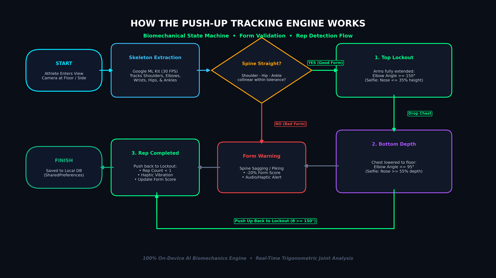
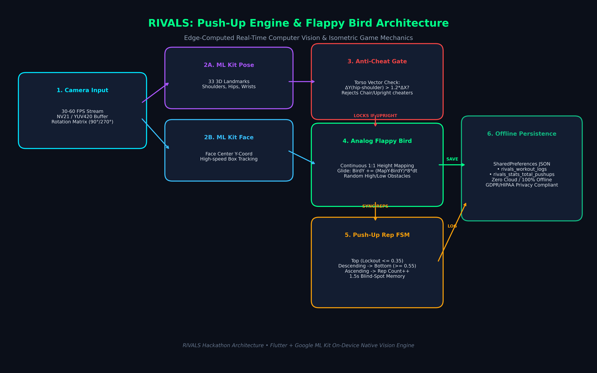
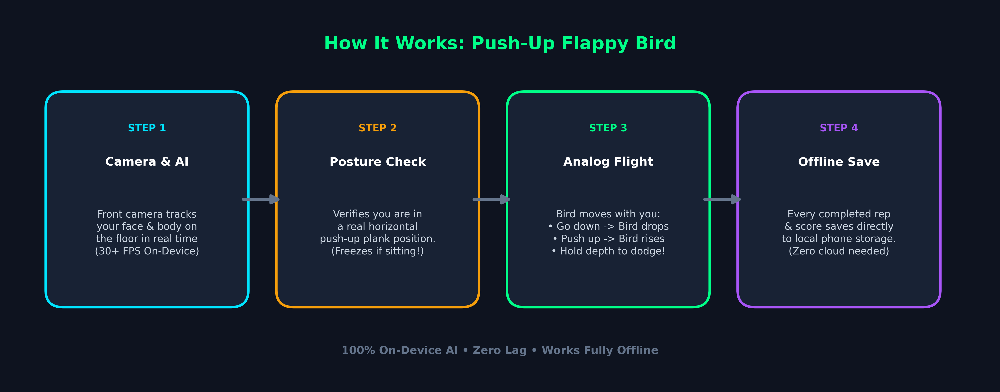
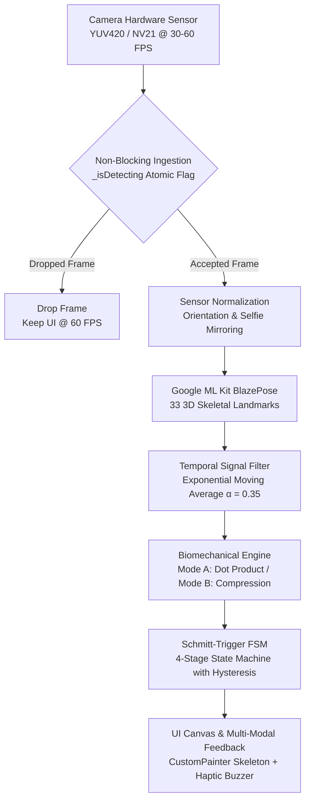

# ⚡ RIVALS — The Hub of Fitness

<div align="center">

[](https://flutter.dev)
[](https://dart.dev)
[](https://developers.google.com/ml-kit)
[](https://github.com/cosmicbyt123/RIVLAS)
[](https://github.com/cosmicbyt123/RIVLAS/releases)

### *“Every one day has a day one”*
### **Grind Together • Grow Together**

**We turn fitness into a verified social competition powered by real-time on-device computer vision.**

[The Real Problem](#-the-real-problem-why-conventional-fitness-apps-fail) • [Our Rivals Teardown](#-our-rivals-the-teardown) • [The Solution](#-the-rivals-solution-verified-social-competition) • [5-Stakeholder Ecosystem](#-5-stakeholder-value-ecosystem) • [Market Opportunity](#-market-opportunity) • [AI Pipeline](#-system-architecture-pipeline) • [Download APK](#-download-apk)

</div>

---

## 🎯 The Real Problem: Why Conventional Fitness Apps Fail

Most fitness apps track data, but **they don't create enough motivation**:
* **Generic Workout & Diet Plans:** Treating human athletes like rows in a spreadsheet.
* **Hollow Gamification:** Existing fitness gamification is mostly empty streaks and badges. **They never care if you actually completed the task or cheated.**
* **Manual Logging Fatigue:** Logging weight and reps into an app feels like clerical homework instead of an athletic grind.

---

## ⚔️ Our Rivals: The Teardown

| Competitor | Their Pitch vs Reality | The Core Flaw |
| :--- | :--- | :--- |
| **CULT.FIT** | *“Come for fitness, stay for subscriptions, classes, and notifications.”* | Locked behind recurring paywalls and pushy notifications. |
| **HEALTHIFY** | *“Count every calorie until you forget why you started.”* | Calorie counting burnout turns nutrition into anxiety. |
| **STRAVA** | *“Because apparently your morning run needs a leaderboard.”* | Hyper-focused on running/cycling maps; ignores functional strength & calisthenics. |
| **HEVY** | *“Log the workout, admire the numbers, repeat the same grind.”* | Passive data notebook with zero live accountability or anti-cheat validation. |

---

## 💡 The RIVALS Solution: Verified Social Competition

RIVALS builds a platform where fitness becomes genuinely fun, accountable, and social:

1. ⚡ **Real-Time Fitness Competition:** Head-to-head live battles against friends, local gym rivals, or simulated AI bots.
2. 🛡️ **AI-Verified Performance (Anti-Cheat):** Powered by on-device Google ML Kit BlazePose. Every repetition, lockout angle, and depth metric is mathematically verified. **Zero fake streaks. No button-mashing.**
3. 🎮 **Fitness As a Game:** Transform physical exertion into tangible progress:
   * **Mountain Ascent:** 1 Push-Up = 5 Meters of Mountain Elevation.
   * **Calisthenics Arcade:** Fly through obstacles in *Push-Up Flappy Bird* controlled by your chest elevation.
4. 🌐 **Connect the Digital & Physical Fitness World:** Uniting home workouts, physical gym floor leaderboards, trainer gauntlets, and brand rewards.

---

## 🤝 5-Stakeholder Value Ecosystem

RIVALS is engineered as a multi-sided fitness network where every participant gains measurable value:

| Stakeholder | Value We Provide |
| :--- | :--- |
| **Athletes / Users** | Motivation, competition, public recognition, and measurable, verified improvement. |
| **Friends** | Grind Together: Live duels, squad challenges, and real-time head-to-head races. |
| **Gyms & Hubs** | Community engagement, customer acquisition, physical-to-digital floor visibility, and member retention. |
| **Fitness Creators / Coaches** | Expand audience, build credibility, and launch anti-cheat verified challenges. |
| **Brands & Sponsors** | Targeted access to an active, fitness-focused community with rewards verified by genuine sweat. |

---

## 📈 Market Opportunity

* **TAM (Total Addressable Market):** **₹20–30 Cr** — Fitness users across initial geographic rollout.
* **SAM (Serviceable Addressable Market):** **₹5–8 Cr** — Young, digitally active fitness enthusiasts who compete and share progress.
* **SOM (Serviceable Obtainable Market):** **₹50L–₹1.5 Cr / year** — Realistically obtainable within the first 2–3 years.

---

## 🔬 Why Most Camera Tracking Fails vs The RIVALS Engine

Toy camera prototypes look impressive in 10-second demos, but collapse during actual workouts. RIVALS solves the 5 physical realities of mobile vision:

1. **Zero Calibration Setup:** No rigid silhouette alignment or pre-set test reps. Dynamic baselines calibrate on-the-fly during natural reps.
2. **Floor View Depth Invariance:** When placing your phone flat on the floor, 2D angles break down. RIVALS computes **Normalized Vertical Compression Ratios** (chest-to-wrist travel relative to torso length), ensuring 95%+ accuracy from floor angles.
3. **Decoupled Scoring ("Count the Rep, Score the Form"):** If form wavers on rep 19 from muscle fatigue, basic apps reject the entire rep. RIVALS counts every valid mechanical rep and scores form quality separately (0–100%).
4. **Schmitt-Trigger Noise Hysteresis:** A 60° buffer zone separates entrance and exit thresholds, mathematically preventing ghost reps when trembling or pausing at the bottom.
5. **100% On-Device & Private:** In-memory neural inference runs at 30–60 FPS via Google ML Kit BlazePose. Zero video is ever uploaded, eliminating privacy concerns and cloud latency.

---

## 📊 How It Works: Flowcharts

### 1. Push-Up Tracking & Form Validation
Detects your body posture, guides you through lockout and depth, and saves your rep data locally:



### 2. Flappy Push-Up Arcade Mode
Push-ups control your flight height in real-time, with an anti-cheat filter that checks plank posture:



### 3. Quick 4-Step Summary



---

## 🏗 System Architecture Pipeline

Every camera frame passes through an 8-stage on-device pipeline:



### The 8 Steps Explained Simply:
1. **Camera Feed:** Reads frames smoothly at 30–60 FPS.
2. **Frame Guard:** Drops extra frames if the phone is busy so the UI always stays silky smooth.
3. **Screen Alignment:** Automatically handles front/back cameras and screen rotation.
4. **AI Pose Detection:** ML Kit BlazePose finds 33 body landmarks (shoulders, elbows, hips, knees, ankles).
5. **Jitter Smoothing:** Filters out camera noise so the tracking doesn't shake.
6. **Rep Engine:** Measures your elbow bend or chest-to-floor depth.
7. **State Machine:** Makes sure you go all the way down and all the way up before counting.
8. **AR Overlay & Vibration:** Draws a glowing neon skeleton on screen and vibrates your phone when a rep completes.

---

## 📐 Smart Rep & Form Tracking

### Mode A: Side Profile View
When the phone is placed to your side, RIVALS calculates your elbow angle:
* **Top (Lockout):** Arm straight ($\ge 155^\circ$)
* **Bottom (Full Depth):** Chest down ($\le 95^\circ$)

### Mode B: Front / Floor View
When your phone is flat on the floor in front of you, RIVALS calculates the ratio between your chest travel and your torso length:
* Works accurately regardless of your height or how far the phone is.
* **Top:** Body extended.
* **Bottom:** Chest down near floor level.

### Spine & Plank Posture Check
* Checks alignment between **Shoulder → Hip → Ankle**.
* If hips sag or pike too much, the app shows a visual cue and adjusts your form score.

---

## 🛡 How Ghost Reps Are Prevented

To prevent accidental double-counts when shaking or pausing, RIVALS uses a multi-stage state machine:

| Stage | What Happens | Requirement |
| :--- | :--- | :--- |
| **1. Ready (Top)** | Starting position | Arms locked out straight |
| **2. Descending** | Lowering down | Chest starts moving toward floor |
| **3. Bottom** | Full depth achieved | Chest reaches required depth |
| **4. Ascending** | Pushing up | Pressing back toward lockout |
| **5. Completed** | **Rep Counted!** | Must return to top after reaching bottom |

> **Why this works:** You cannot trigger a rep count simply by bobbing up and down slightly. You must reach genuine bottom depth and return all the way to lockout.

---

## 👥 2-Player Side-by-Side Tracking

Train with a workout partner on one phone screen:
* **Automatic Split:** Distinguishes athlete on the left from athlete on the right.
* **Independent Counters:** Separate scores, reps, and feedback colors for both players.
* **Pause Memory:** Step away for a quick sip of water (up to 45 seconds) without losing your score.

---

## 🏔 Gamification & The Mountain Ascent

To keep training fun and motivating, your workouts translate into climbing an expedition peak:

* **Elevation Rate:** **1 Push-Up = 5 Meters of Mountain Elevation**
* 🏕️ **Novice Plateau:** 50m (10 Reps)
* 🌲 **Warrior Ridge:** 250m (50 Reps)
* ☁️ **Cloud Break Summit:** 1,000m (200 Reps)
* 🏔️ **Stratosphere Gate:** 3,000m (600 Reps)
* 👑 **Everest Crown:** 8,000m (1,600 Reps)
* ✨ **Celestial Orbit:** 15,000m (3,000 Reps)

### Fitness Arcade
* 🐦 **Push-Up Flappy Bird:** Fly through obstacles by moving your chest up and down.
* ⏱️ **Plank Endurance:** Hold a plank with live posture correction.
* 🤖 **Bot Battles:** Race against simulated competitors or your personal bests.

---

## 📂 Project Structure

```
lib/
├── main.dart                          # App entry point, theme & orientation lock
├── app.dart                           # Navigation shell & persistent tabs
├── painters/
│   └── pose_painter.dart              # Neon skeleton drawing & AR nametags
├── screens/
│   ├── camera_screen.dart             # Real-time AI workout HUD & summary
│   ├── fitness_games_screen.dart      # Fitness arcade selector
│   ├── game_mode_screen.dart          # Push-Up Flappy Bird arcade game
│   ├── home_screen.dart               # Mountain expedition progress & quick launch
│   ├── ranks_screen.dart              # Global & tier leaderboards
│   ├── profile_screen.dart            # Career stats, milestones & history
│   ├── video_verification_screen.dart # Video form analysis for Squats & Push-ups
│   ├── community_screen.dart          # Challenges, feeds & activity
│   └── prototype_competition_screen.dart # Multi-person & bot competition arena
├── services/
│   ├── pose_service.dart              # Core rep tracking, angles & state machine
│   ├── multi_pose_tracker.dart        # 2-player spatial tracking & memory
│   ├── progression_service.dart       # Mountain altitude & milestone unlocks
│   ├── stats_service.dart             # Offline workout logs
│   ├── prototype_bot_engine.dart      # Bot competitors for races
│   └── squat_tracker_service.dart     # Dedicated squat depth engine
├── theme/
│   └── rivals_theme.dart              # Dark theme with neon emerald & amber accents
└── widgets/
    └── bottom_nav.dart                # Bottom navigation bar
```

---

## 🚀 Getting Started

### Requirements
* [Flutter SDK](https://docs.flutter.dev/get-started/install) (3.13+)
* Physical Android or iOS device (camera required for AI pose tracking)

### Run Locally

```bash
git clone https://github.com/cosmicbyt123/RIVLAS.git
cd RIVALS/rivals
flutter pub get
flutter run
```

### Run Tests

```bash
flutter test
```

---

## 📦 Download APK

Download the latest pre-built APK from the [GitHub Releases](https://github.com/cosmicbyt123/RIVLAS/releases) page.

---

## 🔒 Privacy & Performance

* **100% Offline & Private:** No video or images are ever uploaded to any server.
* **Smooth 60 FPS:** Optimized for minimal battery consumption and device thermals.
* **Works Anywhere:** Full offline support—train in airplane mode or basements without cell service.

---

<div align="center">
Built for calisthenics, computer vision, and gamified fitness.
</div>
